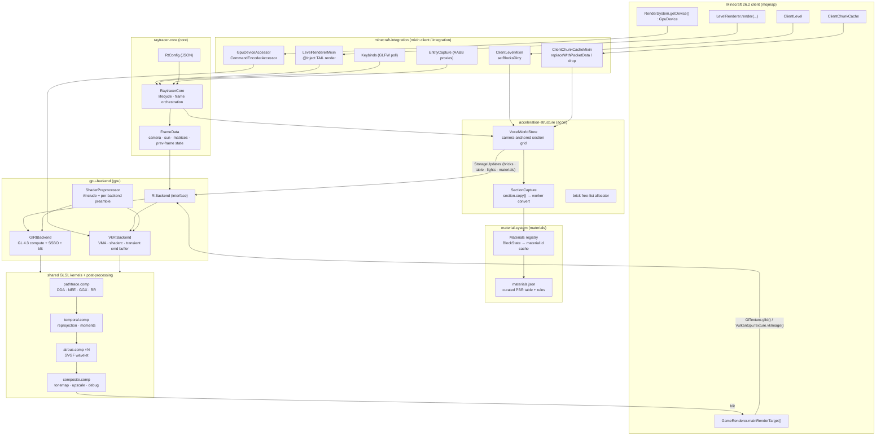
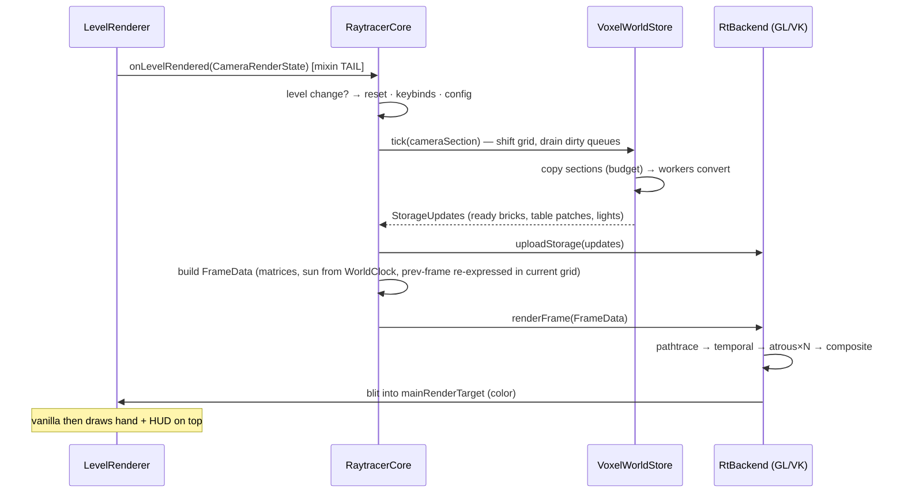

# 03 — Architecture Diagram & Module Map

## System diagram

## Frame sequence

## Module responsibilities & dependency rules

| package | responsibility | may depend on |
|---|---|---|
| `core` | lifecycle, orchestration, config, frame data | `gpu` (interface only), `accel`, `materials` |
| `gpu` | `RtBackend` HAL, shader preprocessing | nothing above it |
| `gpu.gl` | GL 4.3 implementation | `gpu`, LWJGL GL, `GlStateManager` interop |
| `gpu.vk` | Vulkan implementation | `gpu`, LWJGL VK/VMA/shaderc, blaze3d vulkan handles |
| `accel` | world→GPU voxel store, budgets, threading | `materials` |
| `materials` | PBR table, BlockState mapping | Minecraft registries only |
| `mixin.client` + `integration` | hooks, capture, input | `core` |

Rule of thumb enforced in review: **Minecraft types never cross into `gpu`**
(`FrameData`/`StorageUpdates` are plain records of primitives and NIO buffers), so the
renderer core stays engine-portable and unit-testable without a game instance.
